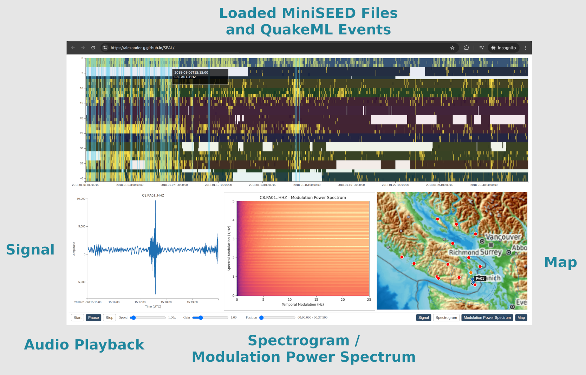

# SEAL: Seismic Exploration & Analysis Lab

A static web application for visualizing seismic data files (MiniSEED) and associated metadata (StationXML, QuakeML). 
All file processing happens locally in the browser, data are not transmitted to servers.

